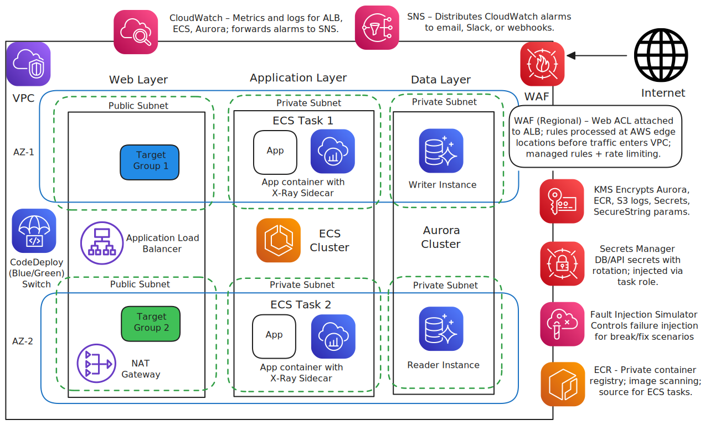

# ECS Fargate Golden Path + Chaos Engineering Lab

[](https://github.com/aws/aws-cdk)
[](https://www.python.org/downloads/)
[](LICENSE)
[](https://github.com/Simodalstix/AWS-ecs-fargate-golden-path/actions)
[](https://github.com/Simodalstix/AWS-ecs-fargate-golden-path/releases)

## In a Nutshell

A production-ready ECS Fargate web service with comprehensive observability, blue/green deployments, and built-in chaos engineering scenarios for incident response training. Deploy once, break things safely, learn how to fix them.

**What you get:** ALB + ECS Fargate + Aurora + WAF + CloudWatch dashboards/alarms + X-Ray tracing + CodeDeploy blue/green + AWS Fault Injection Simulator chaos experiments.

## Quick Start

```bash
# Deploy infrastructure
python -m venv .venv && source .venv/bin/activate
pip install -r infra/requirements.txt
cd infra && cdk bootstrap && cdk deploy --all

# Optional: Subscribe to alarms
cdk deploy --parameters alarm_email=your-email@example.com
```

## Architecture



_Architecture diagram created using AWS official icons and Excalidraw_

```

**Core Components:**
- **VPC**: 2 AZs, public/private subnets, 1 NAT Gateway
- **ECS Fargate**: 2 tasks, health checks, X-Ray sidecars, ECS Exec enabled
- **Aurora Serverless v2**: Writer/reader, Secrets Manager, private subnets
- **ALB**: Blue/green target groups, WAF protection, S3 access logs
- **Observability**: CloudWatch dashboards, 10+ alarms, structured JSON logs
- **Deployment**: CodeDeploy blue/green with auto-rollback on alarms

## Chaos Engineering Lab

Trigger infrastructure failures via AWS Fault Injection Simulator:

| Experiment | Effect | Learning |
|------------|--------|----------|
| **ECS Task Termination** | Kill 50% of tasks → Auto-recovery | Task resilience, health checks |
| **CPU Stress** | 80% CPU load → Autoscaling | Performance under load |
| **Network Latency** | 200ms delays → Response time | Latency tolerance |
| **Aurora Failover** | Force DB failover → Connection handling | Database resilience |

**Game Day Scenarios:**
1. **Task Termination** - Run FIS experiment, observe auto-recovery
2. **Secret Drift** - Rotate DB secret, hit `/db` until errors, redeploy service
3. **CPU Stress** - FIS CPU experiment, watch autoscaling trigger
4. **Network Chaos** - Inject latency, observe p95 metrics

## Application Endpoints

- `/` - App info and health status
- `/healthz` - Health check (ALB target)
- `/work?ms=250` - CPU burn simulation
- `/db` - Database query test

## Project Structure

```

├── app/ # FastAPI application + Dockerfile
├── infra/ # CDK infrastructure code
│ ├── stacks/ # Network, compute, data, observability, FIS
│ ├── custom_constructs/ # Reusable CDK components
│ └── tests/ # Unit tests for infrastructure
├── ops/ # Operations and chaos engineering
│ ├── runbooks/ # Incident response procedures
│ ├── gamedays/ # Chaos experiment scenarios
│ └── queries/ # CloudWatch Insights queries
├── docs/ # Architecture decisions and documentation
│ └── adr/ # Architecture Decision Records
├── .github/ # CI/CD workflows and templates
└── diagrams/ # Architecture diagrams

````

## Key Features

**Production Ready:**
- Multi-AZ high availability
- Blue/green deployments with auto-rollback
- Comprehensive monitoring and alerting
- Security best practices (WAF, private subnets, KMS encryption)
- Cost optimized (1 NAT, Aurora Serverless v2)

**Observability:**
- CloudWatch dashboards for ALB, ECS, RDS metrics
- X-Ray distributed tracing with service maps
- Structured JSON application logs
- 10+ CloudWatch alarms with SNS notifications

**Chaos Engineering:**
- Professional failure injection via AWS FIS
- Infrastructure-level chaos experiments
- Automated rollback on alarm breach
- Enterprise-grade resilience testing

## Cost Considerations

- **Minimal**: ~$50-100/month for learning/demo
- **Optimizations**: Single NAT Gateway, Aurora Serverless v2 min ACUs
- **Scaling**: Configurable task sizes, autoscaling policies

## Testing

**Unit Tests:**
```bash
cd infra && python -m pytest tests/ -v
````

**Integration Testing:**

```bash
# Validate CDK synthesis
export CDK_DEFAULT_ACCOUNT=123456789012 CDK_DEFAULT_REGION=us-east-1
cdk synth --all

# Test application endpoints after deployment
curl https://your-alb-dns/healthz
curl https://your-alb-dns/work?ms=100
```

## Deployment Validation

After deployment, verify:

1. **ALB Health**: All targets healthy in target groups
2. **ECS Tasks**: 2 tasks running across different AZs
3. **Database**: Aurora cluster writer/reader endpoints accessible
4. **Monitoring**: CloudWatch dashboard populated with metrics
5. **Alarms**: SNS topic subscribed and alarms in OK state

## Next Steps

1. **Deploy** - Follow Quick Start above
2. **Validate** - Run deployment validation checks
3. **Explore** - Check CloudWatch dashboards, X-Ray traces
4. **Experiment** - Run FIS chaos experiments
5. **Learn** - Follow runbooks to resolve incidents

## Chaos Experiments

**AWS Fault Injection Simulator Integration:**

- ECS task termination and CPU stress experiments
- Network latency injection for resilience testing
- Aurora failover simulation
- Automated stop conditions via CloudWatch alarms
- Professional chaos engineering patterns

## Why This Matters

This project demonstrates **production-grade cloud engineering practices** that are essential in modern DevOps and SRE roles:

**🏗️ Infrastructure as Code**: Complete AWS infrastructure defined in CDK with proper modularity, testing, and CI/CD

**📊 Observability Excellence**: Comprehensive monitoring, alerting, and distributed tracing - not just "monitoring theater"

**🔄 Deployment Automation**: Blue/green deployments with automated rollback - zero-downtime releases in practice

**⚡ Chaos Engineering**: Professional failure injection using AWS FIS - building resilient systems, not just hoping they work

**💰 Cost Optimization**: Real-world cost considerations with architectural trade-offs clearly documented

**📚 Operational Readiness**: Runbooks, game days, and incident response procedures - because systems fail and teams need to be prepared

This isn't just a demo - it's a **blueprint for production systems** that showcases the intersection of development, operations, and business requirements.

---

**Ready to build resilient systems?** Deploy and start your first chaos experiment! 🚀
