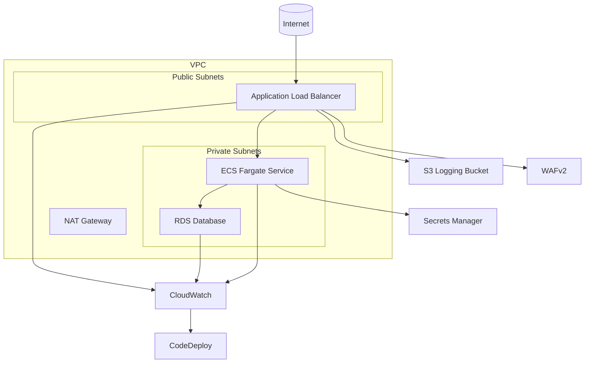

# ECS Fargate Golden Path + Break/Fix Lab

This project provides a production-style ECS Fargate web service with comprehensive observability and a break/fix lab for incident response training.

## Architecture Overview



## Project Structure

```
.
├── app/                    # Sample application
│   ├── Dockerfile
│   ├── app.py
│   └── requirements.txt
├── infra/                  # CDK infrastructure code
│   ├── app.py
│   ├── cdk.json
│   ├── requirements.txt
│   ├── constructs/         # Reusable CDK constructs
│   ├── stacks/             # CDK stacks
│   └── tests/              # Unit tests
└── ops/                    # Operations resources
    ├── gamedays/           # Game day exercises
    ├── queries/            # Log queries
    └── runbooks/           # Incident response runbooks
```

## Components

1. **Core Infrastructure**

   - VPC with public and private subnets
   - ECS Fargate service behind ALB
   - RDS database with Secrets Manager integration
   - WAFv2 protection
   - S3 bucket for ALB access logs

2. **Observability**

   - CloudWatch dashboards
   - Alarms with SNS notifications
   - Structured application logging
   - X-Ray tracing

3. **Deployment**

   - Blue/green deployments with CodeDeploy
   - ECS Exec for debugging

4. **Break/Fix Lab**
   - Simulated failure modes
   - Incident response runbooks
   - Game day exercises

## Getting Started

See [Deployment Instructions](#deployment-instructions) for detailed steps.

## Cost Considerations

- Uses 1 NAT Gateway by default to minimize costs
- Aurora Serverless v2 for database cost optimization
- Configurable ECS task sizes
- S3 lifecycle policies for log retention

## Deployment Instructions

```bash
# Bootstrap & deploy
python -m venv .venv && source .venv/bin/activate
pip install -r infra/requirements.txt
cd infra && cdk bootstrap && cdk deploy --all

# Build and push app image (if not using CDK asset)
aws ecr get-login-password | docker login ...
docker build -t app:latest ./app
docker tag app:latest <acct>.dkr.ecr.<region>.amazonaws.com/app:latest
docker push <acct>.dkr.ecr.<region>.amazonaws.com/app:latest
```
