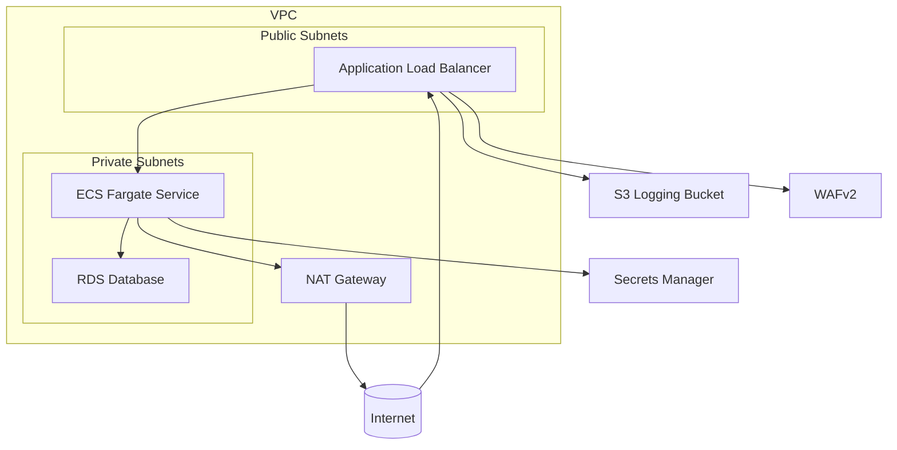
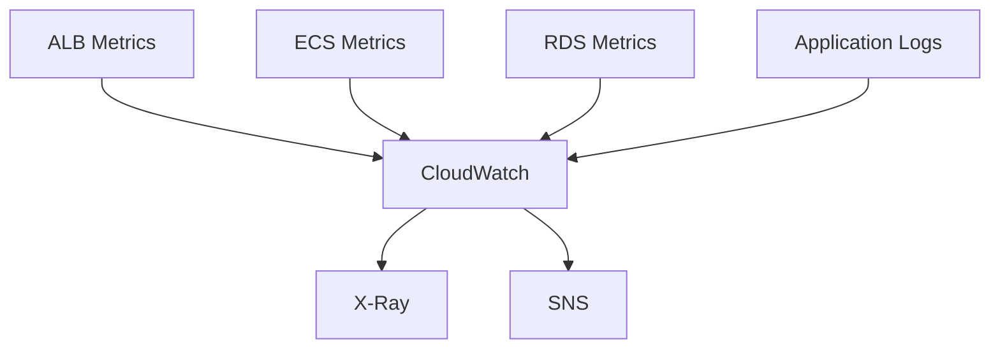
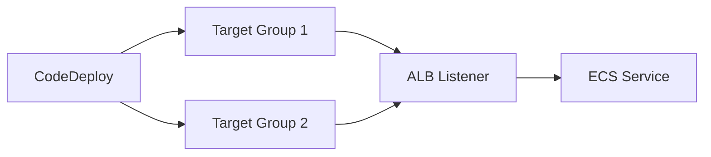

# ECS Fargate Golden Path + Break/Fix Lab

This project provides a production-style ECS Fargate web service with comprehensive observability and a break/fix lab for incident response training.

## Architecture Overview

### Core Infrastructure



### Observability Stack



### Deployment Pipeline



## Project Structure

```
.
├── app/                    # Sample application
│   ├── Dockerfile
│   ├── app.py
│   └── requirements.txt
├── infra/                  # CDK infrastructure code
│   ├── app.py
│   ├── cdk.json
│   ├── requirements.txt
│   ├── constructs/         # Reusable CDK constructs
│   ├── stacks/             # CDK stacks
│   └── tests/              # Unit tests
└── ops/                    # Operations resources
    ├── gamedays/           # Game day exercises
    ├── queries/            # Log queries
    └── runbooks/           # Incident response runbooks
```

## Components

### 1. Core Infrastructure

#### VPC Configuration

- 2 Availability Zones for high availability
- Public subnets for ALB
- Private subnets for ECS tasks and RDS
- NAT Gateway for outbound internet access (configurable: 1 NAT or 1 per AZ)
- Security groups for network isolation

#### ECS Fargate Service

- Desired count: 2 tasks for high availability
- ALB target group with health checks on `/healthz`
- ECR repository for container images
- ECS Exec enabled for live debugging
- X-Ray tracing sidecar daemon
- JSON structured CloudWatch logging

#### RDS Database

- Engine options: PostgreSQL, MySQL, Aurora PostgreSQL (default)
- Aurora Serverless v2 for cost optimization (default)
- Private subnets with no direct internet access
- Security group allowing access only from ECS tasks
- Secrets Manager for credential storage
- Optional automatic credential rotation

#### Application Load Balancer

- Internet-facing with public subnets
- WAFv2 regional web ACL attached
- Access logs to S3 bucket with KMS encryption
- Health checks for target groups

#### WAFv2 Protection

- Managed rule sets: CommonRuleSet, KnownBadInputs, AmazonIpReputation
- Custom rate-based rule: 2000 requests per 5 minutes per IP
- Initially in COUNT mode for tuning, with runbook for BLOCK mode

### 2. Observability Stack

#### CloudWatch Dashboards

- ALB metrics: 4xx/5xx rates, p95 latency
- ECS metrics: CPU/Memory utilization, task count
- RDS metrics: CPU utilization, connections, free storage
- RequestCountPerTarget metrics
- WAF block metrics

#### Alarms and Notifications

- ALB 5xx rate > 1% for 5 minutes
- TargetResponseTime p95 > threshold
- ECS RunningTaskCount < desired
- RDS free storage / connections / CPU
- WAF rule block surge (metric math from sampled requests)
- SQS DLQ depth (if used in optional module)

#### Application Logging

- JSON structured logs with requestId, path, status, errorType, latencyMs
- Log metric filters for errorType from app JSON logs
- Log metric filters for status>=500 counter

#### X-Ray Tracing

- Sidecar daemon for trace collection
- Integration with application for distributed tracing

### 3. Deployment Pipeline

#### CodeDeploy Blue/Green

- Two target groups for traffic shifting
- Listener rules for traffic routing
- Auto-rollback on alarm: ALB 5xx and TargetResponseTime
- AppSpec/hook Lambda stored in the stack
- Optional CDK Pipeline integration

#### ECS Exec

- Enabled for live debugging of running tasks
- Secure access to container filesystem and processes

### 4. Break/Fix Lab

#### Failure Modes

- 502/Unhealthy targets: change health check path or return 500s
- DB credential drift: rotate secret while app still reads env var
- Connection leak: app mode that never closes connections
- CPU burn: endpoint that performs CPU-intensive work
- WAF false positive: rule in COUNT → BLOCK to show impact

#### Reset Mechanism

- Automated job to restore healthy configuration
- SSM Parameter or minimal admin API for triggering failures

## Sample Application

### FastAPI Application Endpoints

- `/` - Returns JSON response with application information
- `/healthz` - Health check endpoint returning 200 OK
- `/work` - Simulates CPU-intensive work (accepts `ms` parameter)
- `/db` - Performs a simple database query

### Application Features

- Reads SSM Parameter `failure_mode` each request to flip behaviors
- X-Ray SDK integration for distributed tracing
- Structured JSON logs with requestId, path, status, errorType, latencyMs
- Environment variables for configuration:
  - `DB_SECRET_ARN` - Database secret ARN
  - `PARAM_FAILURE_MODE` - SSM parameter name for failure mode

## Break/Fix Lab Implementation

### Failure Modes via SSM Parameter

1. **502/Unhealthy targets**

   - Set `/golden/failure_mode` to `return_500` to make health checks fail
   - Observe ALB 5xx alarms and unhealthy targets

2. **DB credential drift**

   - Rotate secret manually in Secrets Manager
   - Hit `/db` endpoint until errors occur
   - Redeploy service to pick up new credentials

3. **Connection leak**

   - Set `/golden/failure_mode` to `connection_leak`
   - Monitor RDS connections metric
   - Restart tasks or implement connection pooling

4. **CPU burn**

   - Call `/work?ms=250` endpoint repeatedly
   - Watch autoscaling trigger based on CPU or request count
   - Observe p95 latency metrics

5. **WAF false positive**
   - Temporarily set strict rate rule to BLOCK
   - Observe WAF block metrics
   - Tune rules and revert to COUNT mode

### Reset Mechanism

- Set `/golden/failure_mode` to `none` to restore healthy behavior
- Automated reset job available for game day exercises

## Operations Resources

### Runbooks

1. **ALB 5xx spike**

   - Check target health status
   - Use CloudWatch Insights queries for analysis
   - Execute CodeDeploy rollback to previous task definition
   - Confirm service recovery

2. **Slow p95 response times**

   - Inspect X-Ray traces for hot endpoints
   - Scale out via desired count adjustment
   - Verify autoscaling has kicked in

3. **DB authentication failures**

   - Confirm environment-based credentials are outdated
   - Redeploy service to pick up new secret
   - Implement long-term fix with runtime credential fetching or RDS Proxy

4. **Connection exhaustion**

   - Monitor DBConnections metrics
   - Restart tasks to clear connections
   - Implement connection pooling or RDS Proxy

5. **WAF false positive blocks**
   - Analyze sampled requests for patterns
   - Add exceptions or scope-down rules
   - Move rule back to BLOCK mode after tuning

### Game Day Exercises

1. **Unhealthy targets scenario**

   - Set failure_mode=return_500 in SSM
   - Monitor 5xx alarm triggering
   - Execute rollback deployment
   - Reset parameter to restore health

2. **Secret drift scenario**

   - Manually rotate database secret
   - Hit /db endpoint until errors occur
   - Redeploy service to fix authentication
   - Document mean time to recovery (MTTR)

3. **CPU burn scenario**

   - Run load test against /work endpoint
   - Observe autoscaling and p95 latency
   - Verify scale stabilization

4. **WAF block scenario**
   - Temporarily set strict rate rule to BLOCK
   - Observe WAF block metrics
   - Tune rules and revert configuration

## CDK Project Structure

The infrastructure is organized into modular CDK constructs and stacks:

### Stacks

- `network_stack.py` - VPC, subnets, NAT gateways
- `data_stack.py` - RDS database and Secrets Manager
- `compute_stack.py` - ECS service, ALB, WAF
- `observability_stack.py` - CloudWatch dashboards, alarms, log metrics
- `deployment_stack.py` - CodeDeploy blue/green configuration

### Reusable Constructs

- `kms_key.py` - KMS key for encryption
- `logging_bucket.py` - S3 bucket for ALB access logs
- `waf_web_acl.py` - WAF web ACL with managed rules
- `ecs_service_alb.py` - ECS service with ALB integration
- `rds_cluster.py` - RDS cluster with security groups
- `dashboards.py` - CloudWatch dashboards
- `alarms.py` - CloudWatch alarms with SNS integration
- `log_metrics.py` - Log metric filters

## Testing

Unit tests are provided for critical CDK constructs:

- ECS service has FargateCapacityProviderStrategy or Fargate only
- ALB has access logging enabled to the logging bucket
- Task role restricted to specific secret ARN + SSM param
- WAF associated to ALB with expected rule names
- CodeDeploy Application + DeploymentGroup configured with blue/green + alarms
- RDS SG denies 0.0.0.0/0 ingress; only from ECS SG

## Interview Crib Notes

### Fargate Scaling

- Target tracking on ALBRequestCountPerTarget complements CPU scaling
- Scale-in cooldown prevents thrashing

### Blue/Green vs Rolling Deployments

- CodeDeploy provides traffic shifting + auto-rollback on alarms
- Rolling deployments are simpler but riskier

### Common 5xx Causes

- Bad health checks
- Connection pool exhaustion
- Cold database connections
- Application errors
- Triage via ALB target health, app logs, X-Ray, and RDS metrics

### Secrets Management

- Environment variable anti-pattern vs runtime fetch
- Rotation implications
- RDS Proxy for pooling and IAM auth

### Cost Optimization Levers

- One NAT vs per-AZ
- Aurora Serverless v2 min ACUs
- Task size selection
- WAF managed rules only where needed
- Logs lifecycle policies

## Getting Started

See [Deployment Instructions](#deployment-instructions) for detailed steps.

## Cost Considerations

- Uses 1 NAT Gateway by default to minimize costs
- Aurora Serverless v2 for database cost optimization
- Configurable ECS task sizes
- S3 lifecycle policies for log retention

## Deployment Instructions

```bash
# Bootstrap & deploy
python -m venv .venv && source .venv/bin/activate
pip install -r infra/requirements.txt
cd infra && cdk bootstrap && cdk deploy --all

# Build and push app image (if not using CDK asset)
aws ecr get-login-password | docker login ...
docker build -t app:latest ./app
docker tag app:latest <acct>.dkr.ecr.<region>.amazonaws.com/app:latest
docker push <acct>.dkr.ecr.<region>.amazonaws.com/app:latest
```
